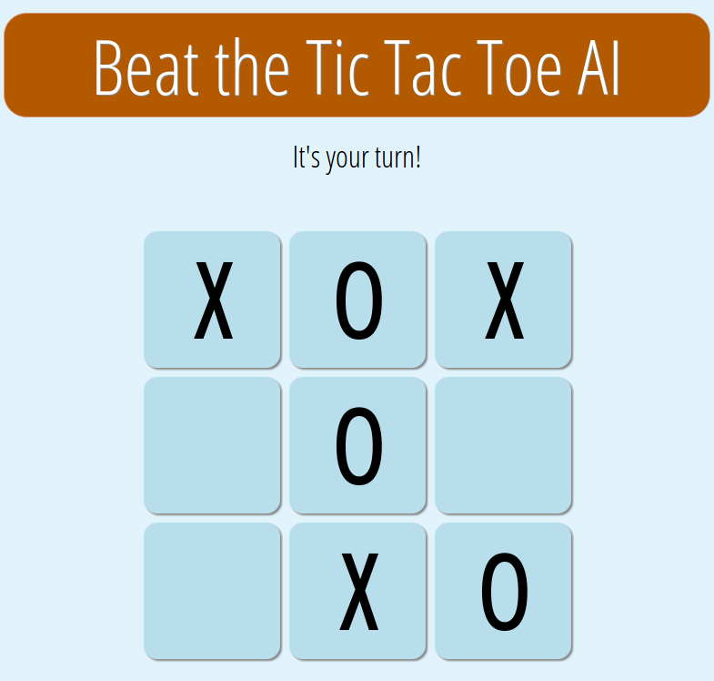

# Tic Tac Toe

This is an implementation of the classic game Tic Tac Toe. It consists of a web UI and a REST service. The REST service manages the games and implements the game engine. The game engine's AI is based on the minimax algorithm which makes the AI unbeatable.



# Setup

The REST service is a standalone Python script which is listening on port 5000 for requests. The web UI is a simple JavaScript application.

## Get the sources

To play Tic Tac Toe get the sources first and change into the `tictactoe` directory.

```bash
git clone https://github.com/daniel-e/tictactoe.git
cd tictactoe
```

## Install a Nginx web server

```bash
tar xzf extra/nginx-1.10.3.tar.gz
cd nginx-1.10.3/
./configure --prefix=/opt/nginx
make -j4
make install
cd ..
rm -rf nginx-1.10.3/
```

```bash
mv /opt/nginx/html /opt/nginx/html.orig
ln -s $PWD/html /opt/nginx/html
```

### Configure Nginx

Modify the `server` section in `/opt/nginx/conf/nginx.conf` as follows:
```
server {
  listen       10000;
  server_name  localhost;
  # redirect calls to the REST service to port 5000
  location ~ ^/(new|status|set) {
    proxy_pass    http://127.0.0.1:5000;
  }
  location / {
    root   html;
    index  index.html;
  }
}
```

# start

In root directory: ./rest.py
starts the rest service on port 5000

/opt/nginx/sbin/nginx


pkill -HUP nginx
------------------------------------------------------------------------------

TODO
* button for new game

# REST interface

## New game
curl -X POST localhost:5000/new

## Get status of a game
curl -s -X GET localhost:5000/status/<uid> | jq .

status:
* HUMAN_WINS
* AI_WINS
* WAITING_FOR_AI
* WAITING_FOR_HUMAN
* DRAW
board:
* X = HUMAN
* O = AI

## Human move
curl -v -X POST localhost:5000/set/<ui>/<x>/<y>

response json:
{
  "error": "OK"
}
