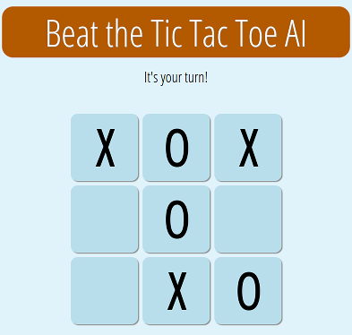

# Tic Tac Toe

This is an implementation of the classic game Tic Tac Toe. It consists of a web UI and a REST service. The REST service manages the games and implements the game engine. The game engien's AI is based on the minimax algorithm which makes the AI unbeatable.



## Get the sources

```
git clone https://github.com/daniel-e/tictactoe.git
```

# start
In root directory: ./rest.py
starts the rest service on port 5000

## Install Nginx
nginx nach /opt/nginx installieren

Softlink in /opt/nginx/ anlegen:
ln -s ~/Dropbox/github/testing/ttt_ai/html/ html

/opt/nginx/conf/nginx.conf
    server {
        listen       10000;
        server_name  localhost;

        location /new {
            proxy_pass    http://127.0.0.1:5000;
        }
        location /status {
            proxy_pass    http://127.0.0.1:5000;
        }
        location /set {
            proxy_pass    http://127.0.0.1:5000;
        }
        location / {
            root   html;
            index  index.html index.htm;
        }
    }

pkill -HUP nginx
------------------------------------------------------------------------------

TODO
* button for new game

# REST interface

## New game
curl -X POST localhost:5000/new

## Get status of a game
curl -s -X GET localhost:5000/status/<uid> | jq .

status:
* HUMAN_WINS
* AI_WINS
* WAITING_FOR_AI
* WAITING_FOR_HUMAN
* DRAW
board:
* X = HUMAN
* O = AI

## Human move
curl -v -X POST localhost:5000/set/<ui>/<x>/<y>

response json:
{
  "error": "OK"
}
